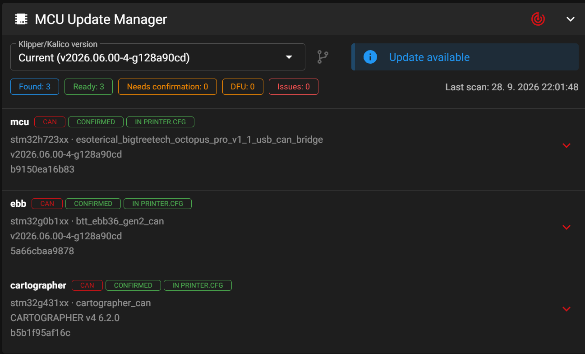

# MCU Update Manager

Experimental Mainsail panel and Moonraker component for discovering and updating Klipper/Kalico MCUs connected over CAN or USB. The panel can match a device to a hardware profile, build firmware, flash supported devices, show operation progress and logs, and select older firmware versions. Cartographer and STM32 DFU have guided flows. **A profile appearing in the catalog does not mean that automatic flashing is supported for that board.**



## Before you install

- This is a **beta**. Flashing the wrong profile, pins, bootloader offset, or target can make a board inaccessible until you recover it in DFU/BOOTSEL. Check the exact board revision and have a recovery method ready.
- The prebuilt UI is based on **Mainsail v2.19.0**. It replaces the files in `~/mainsail`; it is not a runtime Mainsail plugin. A later Mainsail update can remove the panel. Do not use the UI package on a different Mainsail version without rebuilding it.
- The installer backs up Mainsail and Moonraker configuration. It does **not** flash firmware, change `printer.cfg`, or restart Klipper. Run it when the printer is idle.
- Standard paths are assumed: `~/mainsail`, `~/moonraker`, and `~/printer_data/config/moonraker.conf`. Review `scripts/install.sh` if your setup differs.
- Python 3.11 or newer, `git`, `curl`, and `tar` are needed on the printer host. CAN/USB/DFU flashing additionally needs the relevant tools (such as Katapult and `dfu-util`).

## Install on a printer

SSH into the printer, then run:

```bash
cd ~
git clone https://github.com/locki-cz/mcu-update-manager.git
cd mcu-update-manager
bash scripts/install.sh
```

The installer downloads the matching [beta release](https://github.com/locki-cz/mcu-update-manager/releases), backs up `~/mainsail`, installs the Moonraker component, adds an include to `moonraker.conf` if needed, restarts Moonraker, and verifies its API. Refresh Mainsail with Ctrl+F5 and open **Machine > MCU Update Manager**. Discovery runs only when you click the scan button.

If Katapult is not installed, the panel can still discover devices, but Katapult-based flashing will not be available. Do not confirm a profile until you have verified the exact board and revision.

For an existing checkout, update the backend with `git pull` and restart Moonraker. UI updates require a compatible release package; this beta does not automatically merge with newer Mainsail versions.

## Verify or troubleshoot

```bash
curl -fsS http://127.0.0.1:7125/machine/mcu_update_manager/status
systemctl is-active moonraker
journalctl -u moonraker -n 80 --no-pager
```

The API response should contain `devices` (possibly empty before discovery). A 404 means the Moonraker component did not load. Check its error in the journal. The Moonraker entry file must be a **regular file**, not a symlink to the backend module; the installer handles this explicitly.

The installer prints the backup directory it created. To restore the previous Mainsail UI, extract its `mainsail-*.tar.gz` backup into your home directory. Restore the corresponding `moonraker.conf` and component backup only if you also want to remove the backend integration, then restart Moonraker.

## Hardware profiles and source

Profiles are YAML files under [`profiles/`](profiles/README.md), grouped into `mainboard`, `toolhead`, `cartographer`, and `beacon`. The user's confirmed device-to-profile assignments are stored separately in `devices.yaml` on the printer and are not part of this repository. Many catalog entries are discovery-only placeholders; only profiles with complete build and flash settings can be used automatically.

The Moonraker component lives in [`mcu_update_manager/`](mcu_update_manager/) and registers `/machine/mcu_update_manager/*` endpoints. The UI is currently compiled into a Mainsail 2.19.0 build. [`frontend/`](frontend/README.md) contains the panel source and integration patch so the modified frontend can be inspected and rebuilt. This is **not** an official Mainsail plugin and is not affiliated with the Mainsail team.

This project and the modified Mainsail frontend are distributed under GPL-3.0. Mainsail is by the [Mainsail Crew](https://github.com/mainsail-crew/mainsail); see the source repository for upstream credits.
